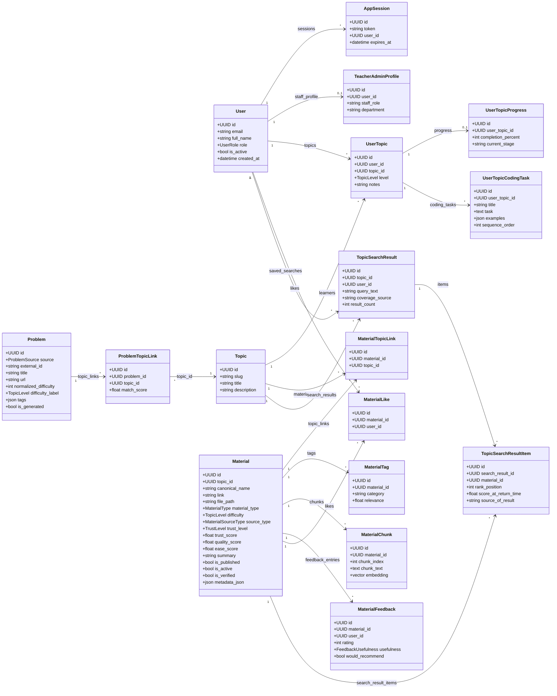

# Apollo — UML Diagrams

All diagrams below are written in [Mermaid](https://mermaid.js.org/) and render
automatically on GitHub. To preview locally, paste the fenced block into the
[Mermaid Live Editor](https://mermaid.live).

The three views describe Apollo from three angles:

1. **Class diagram** — persistent domain model (SQLAlchemy entities in `backend/db/models.py`).
2. **Component diagram** — runtime architecture across frontend, backend, agents and external services.
3. **Sequence diagram** — end-to-end flow of the hybrid RAG material search, the
   core feature described in `RAPORT.md`.

---

## 1. Class diagram — domain model

Reflects the ORM entities and their relationships. Enum-typed columns are shown
as short attribute annotations.

