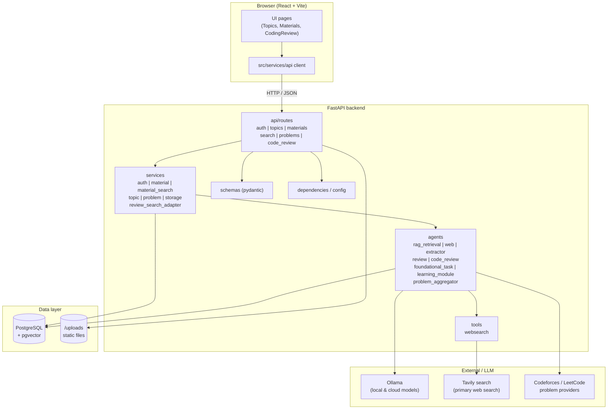
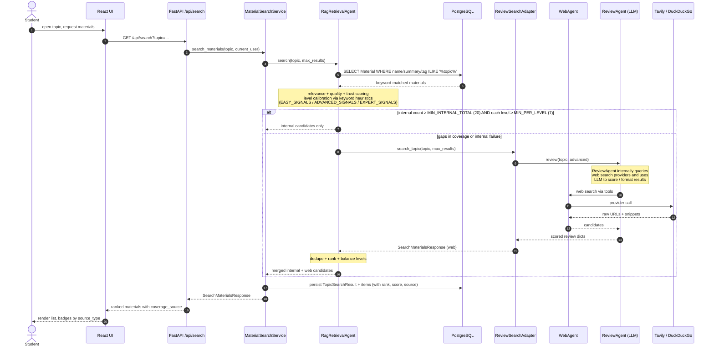

# Apollo — UML Diagrams

All diagrams below are written in [Mermaid](https://mermaid.js.org/) and render
automatically on GitHub. To preview locally, paste the fenced block into the
[Mermaid Live Editor](https://mermaid.live).

The three views describe Apollo from three angles:

1. **Class diagram** — persistent domain model (SQLAlchemy entities in `backend/db/models.py`).
2. **Component diagram** — runtime architecture across frontend, backend, agents and external services.
3. **Sequence diagram** — end-to-end flow of the hybrid RAG material search, the
   core feature described in `RAPORT.md`.

---

## 1. Class diagram — domain model

Reflects the ORM entities and their relationships. Enum-typed columns are shown
as short attribute annotations.

---

## 2. Component diagram — runtime architecture

Shows how the React frontend talks to the FastAPI backend, how the backend
delegates to services and AI agents, and which external systems the agents call.

---

## 3. Sequence diagram — hybrid RAG material search

Captures the "search materials for a topic" path as actually implemented in
`backend/agents/rag_retrieval_agent.py` and `backend/services/material_search_service.py`.
The retrieval is keyword-based (SQL `ILIKE` on `Material.canonical_name`, `summary`
and `MaterialTag.category`) plus a heuristic level calibration; the
`MaterialChunk.embedding` HNSW index exists in the schema but is not queried by
the current RAG agent. Web fallback runs through `ReviewSearchAdapter`, which
internally uses `WebAgent` and the LLM-based `ReviewAgent` to score and
calibrate external candidates.

